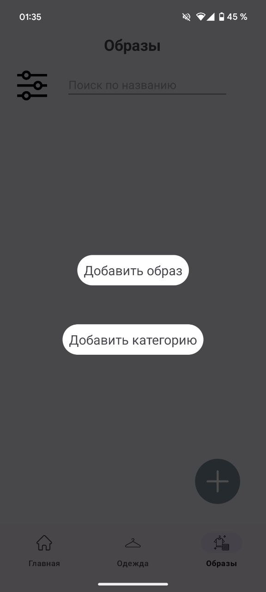
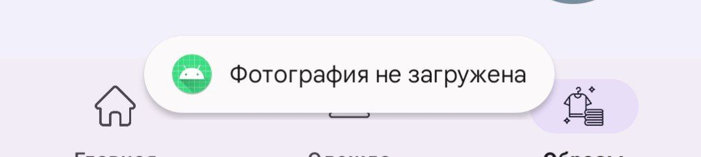

# **ПРИЛОЖЕНИЕ ДЛЯ ОРГАНИЗАЦИИ ГАРДЕРОБА «MATCHCLOTHES»**

### **СОДЕРЖАНИЕ**
[1.	Назначение программы](#_toc162874981)

[1.1. Функциональное назначение](#_toc162874982)

[1.2. Эксплуатационное назначение](#_toc162874983)

[2. Условия выполнения программы](#_toc162874984)

[2.1. Минимальный состав аппаратных средств](#_toc162874985)

[2.2. Минимальный состав программных средств](#_toc162874986)

[2.3. Требования к персоналу (пользователю)](#_toc162874987)

[3. Выполнение программы](#_toc162874988)

[3.1. Установка программы](#_toc162874989)

[3.2. Запуск программы и работа с приложением](#_toc162874990)

[3.2.1. Аутентификация](#_toc162874991)

[3.2.2. Главная](#_toc162874992)

[3.2.3. Настройки](#_toc162874993)

[3.2.4. Одежда	](#_toc162874994)

[3.2.5. Образы	](#_toc162874995)

[3.2.6. Календарь	](#_toc162874996)

[3.2.7. Путешествия	](#_toc162874997)

[4. Сообщения оператору	](#_toc162874998)

[4.1. Тексты сообщений оператору	](#_toc162874999)

[4.2. Действия оператора в исключительных ситуациях	](#_toc162875000)

1. **Назначение программы**

` `**1.1. Функциональное назначение**

Разрабатываемое приложение предназначено для эффективной организации гардероба: оно позволяет добавлять фотографии вещей, распределять их по категориям и сезонам, создавать образы, распределять их по категориям и сезонам, а также распределять вещи и образы по дням недели и планировать, какую одежду необходимо взять с собой в путешествие. Приложение поддерживает добавление дополнительной информации о вещах и образах, которая поможет сохранить важную информацию и ухаживать за вещами.

**1.2. Эксплуатационное назначение**

Основными конечными потребителями разрабатываемого приложения являются люди, которые ценят организованный подход к хранению и выбору одежды, стремятся к удобству и эффективности в управлении своим гардеробом.

Для корректного использования программы пользователю необходим смартфон с операционной системой Android и доступ в интернет.

**2. Условия выполнения программы**

**2.1. Минимальный состав аппаратных средств**

- Мобильное устройство с возможностью использования операционной системы Android версии 7 и выше, оснащенное 64-разрядным (x64) процессором и камерой
- 100мб оперативной памяти (ОЗУ) или больше
- 1гб свободного места на внутреннем накопителе или больше
- Возможность подключения к сети интернет

**2.2. Минимальный состав программных средств**

Во время испытаний должны быть использованы следующие программные средства:

- Среда разработки Android Studio версии 2023.2.1
- Устройство с операционной системой Android версии 7 и выше

**2.3. Требования к персоналу (пользователю)**

Для работы с приложением достаточно одного человека, обладающего навыком работы с смартфоном с операционной системой Android версии 7.0 и выше, а также навыком скачивать и устанавливать приложения.

Специальных требований к квалификации не предъявляется.

**3. Выполнение программы**

**3.1. Установка программы**

Мобильное приложение доступно для установки через файл формата .apk. Вы можете загрузить APK файл из официального github репозитория проекта по ссылке https://github.com/yuulkht/MatchClothesApp. Загрузка свободная и не требует регистрации или каких-либо других действий.

**3.2. Запуск программы и работа с приложением**

**3.2.1. Аутентификация**

После запуска мобильного приложения пользователь попадает на страницу входа в приложения. Если пользователь не зарегистрирован, он имеет возможность перейти на страницу регистрации, нажав на кнопку “Зарегистрироваться”. Со страницы регистрации также можно перейти на страницу входа, нажав кнопку “Войти”.

*Рисунок 1. Экраны входа и регистрации*

Для входа или регистрации необходимы следующие данные:

- Адрес электронной почты (в формате user@email.com) вводится в поле “Введите email”
- Пароль – состоит минимум из 6 символов, вводится в поле “Введите пароль”

После ввода данных необходимо нажать на кнопку “Войти” или, соответственно, “Зарегистрироваться”. 

При успешном входе пользователь попадает на главный экран приложения, при неуспешном – остается на экране входа. 

При успешной попытке регистрации пользователь попадает на следующий экран:

*Рисунок 2. Экран подтверждения email*

Для подтверждения регистрации пользователь должен перейти в электронную почту и перейти по ссылке из письма, которое придет ему в качестве подтверждения адреса электронной почты. После этого пользователь должен перейти в приложение и нажать кнопку “Я подтвердил(а) email”. Далее пользователь увидит уведомление об успешности его регистрации. При успешной регистрации он попадает на главный экран приложения, при неуспешной – на экран входа.

**3.2.2. Главная**

При успешном входе или успешной регистрации пользователь попадает на главный экран приложения:

*Рисунок 3. Главная*

- Справа сверху располагается иконка шестеренок – кнопка, с помощью которой можно перейти в раздел настроек
- Ниже, в середине экрана расположены 4 кнопки для перемещения между разделами приложения – «Одежда», «Образы», «Календарь», «Путешествия»
- Внизу экрана расположена навигационная панель, с помощью которой пользователь может перемещаться между разделами «Главная», «Одежда», «Образы»

**3.2.3. Настройки**

Перейдя в раздел настроек, пользователь увидит экран:

*Рисунок 4. Настройки*

- В верхнем левом углу расположена кнопка «Назад» в виде стрелочки, при нажатии на нее пользователь попадет на «Главную»
- Чтобы изменить адрес электронной почты, пользователь должен ввести новый адрес в поле «Введите новый email», нажать «Сохранить изменения» и подтвердить новый адрес электронной почты по ссылке в письме
- Чтобы выйти из учетной записи, пользователь должен нажать на кнопку «Выйти», при этом он попадет на экран входа в приложение
- В середине экрана указана почта разработчика, куда пользователь может написать в случае возникновения проблем с приложением

**3.2.4. Одежда**

При переходе в раздел «Одежда» пользователь увидит следующий экран:

*Рисунок 5. Одежда*

- На экране расположены карточки вещей, добавленных в приложение, для каждой фотография и название
- Сверху слева расположена кнопка для установки конкретной категории или сезона, при нажатии на нее:

  

  *Рисунок 6. Выбор категории или сезона*

- Чтобы перейти на соответствующую категорию или сезон, необходимо нажать на соответствующую кнопку
- Чтобы удалить категорию, необходимо нажать на иконку мусорного ведра рядом с названием категории
- Чтобы сбросить фильтр, необходимо нажать на кнопку «Сбросить» в нижней части экрана
- Рядом с кнопкой фильтрации расположена строка для поиска вещи по названию. Чтобы найти определенную вещь, необходимо начать вводить ее название в строку:

  

  *Рисунок 7. Поиск по названию* 

- Чтобы перейти на карточку вещи, необходимо нажать на миниатюру в списке вещей на главном экране:

  

  *Рисунок 8. Карточка вещи*

- Чтобы удалить вещь, необходимо нажать на значок мусорного ведра в верхнем правом углу
- Чтобы вернуться назад на экран «Одежда», необходимо нажать на стрелочку в верхнем левом углу экрана
- Чтобы добавить вещи или категорию вещей, необходимо нажать на кнопку «Плюс»:

  

  *Рисунок 9. Добавление вещи или категории*

  На экране необходимо выбрать, что именно будет добавлено. Далее в зависимости от выбора:

- Добавление вещи:

  

  

  *Рисунок 10. Добавление вещи*

- Для добавления вещи необходимо загрузить фотографию из памяти устройства или сделать фотографию, не выходя из приложения. Далее загруженную фотографию необходимо обрезать, перемещая граничные линии обрезки, после этого нажать «Обрезать»
- После добавления фотографии необходимо ввести название новой вещи, указать категории и сезоны для вещи, дополнительную информацию и сохранить вещь
- Добавление категории:

  

  *Рисунок 11. Добавление категории*

- Чтобы добавить категорию, необходимо ввести название новой категории и выбрать вещи, которые будут в этой категории находиться, далее нажать «Сохранить категорию»

**3.2.5. Образы**

При переходе в раздел «Образы» пользователь увидит следующий экран:

*Рисунок 12. Образы*

- На экране расположены карточки образов, добавленных в приложение, для каждой фотография и название
- Сверху слева расположена кнопка для установки конкретной категории или сезона, при нажатии на нее:

  

  *Рисунок 13. Выбор категории или сезона образов*

- Чтобы перейти на соответствующую категорию или сезон, необходимо нажать на соответствующую кнопку
- Чтобы удалить категорию, необходимо нажать на иконку мусорного ведра рядом с названием категории
- Чтобы сбросить фильтр, необходимо нажать на кнопку «Сбросить» в нижней части экрана
- Рядом с кнопкой фильтрации расположена строка для поиска образа по названию. Чтобы найти определенный образ, необходимо начать вводить его название в строку
- Чтобы перейти на карточку образа, необходимо нажать на миниатюру в списке образов на главном экране:

*Рисунок 14. Карточка образа*

- Чтобы удалить образ, необходимо нажать на значок мусорного ведра в верхнем правом углу
- Чтобы вернуться назад на экран «Образы», необходимо нажать на стрелочку в верхнем левом углу экрана
- Чтобы добавить образ или категорию образов, необходимо нажать на кнопку «Плюс»:

  

  *Рисунок 15. Добавление образа или категории*

  На экране необходимо выбрать, что именно будет добавлено. Далее в зависимости от выбора:

- Добавление образа:

  

  *Рисунок 16. Добавление образа*

- Для добавления образа необходимо выбрать вещи для образа, нажать «Далее»
- Далее необходимо загрузить фотографию из памяти устройства или сделать фотографию, не выходя из приложения. Загруженную фотографию необходимо обрезать, перемещая граничные линии обрезки, после этого нажать «Обрезать»
- После добавления фотографии необходимо ввести название нового образа, указать категории и сезоны для образа, дополнительную информацию, и сохранить образ
- Добавление категории:

  

  *Рисунок 17. Добавление категории*

- Чтобы добавить категорию, необходимо ввести название новой категории и выбрать образы, которые будут в этой категории находиться, далее нажать «Сохранить категорию»

**3.2.6. Календарь**

При переходе в раздел «Календарь», пользователь попадает на экран:

*Рисунок 18. Календарь*

В календаре отмечена текущая дата, при этом календарь интерактивен – можно выбирать конкретную дату, пролистывать месяцы.

Для каждого дня можно посмотреть и обновить «Вещи дня» и «Образы дня»:

- Вещи дня:

  

  *Рисунок 19. Вещи дня*

- Чтобы вернуться назад, необходимо нажать на стрелочку «Назад» в левом верхнем углу
- Чтобы обновить список вещей, необходимо нажать на иконку «Обновить» в правом верхнем углу:

  

  *Рисунок 20. Добавление вещей*

На экране необходимо выбрать новый список вещей для выбранной даты и нажать «Далее», чтобы перейти на главную страницу «Календаря».

- Образы дня:

  

  *Рисунок 21. Образы дня*

- Чтобы вернуться назад, необходимо нажать на стрелочку «Назад» в левом верхнем углу
- Чтобы обновить список вещей, необходимо нажать на иконку «Обновить» в правом верхнем углу:

*Рисунок 22. Добавление образов*

На экране необходимо выбрать новый список образов для выбранной даты и нажать «Далее», чтобы перейти на главную страницу «Календаря».

**3.2.7. Путешествия**

Перейдя в раздел «Путешествия», пользователь увидит экран с списком всех путешествий:

*Рисунок 23. Путешествия*

- Чтобы удалить путешествие, необходимо нажать на иконку мусорного ведра рядом с названием
- Чтобы просмотреть путешествие, необходимо нажать на название:

*Рисунок 24. Карточка путешествия*

На странице приведен список вещей (чемодан), которые необходимо взять в путешествие, чтобы собрать все образы и вещи, указанные при создании путешествия. Чтобы обновить список вещей или образов, нужно нажать на «Обновить вещи» или «Обновить образы». В зависимости от действия, следующим экраном будет один из двух приведенных экранов:

*Рисунок 25. Обновление вещей и образов*

Необходимо выбрать новые вещи или образы и нажать далее, чтобы перейти на страницу «Путешествия»

- Чтобы добавить новое путешествие, необходимо нажать на кнопку «Плюс»:

  

  *Рисунок 26. Добавление названия путешествия*

На экране необходимо ввести название нового путешествия и нажать «Далее». После этого нужно выбрать вещи и образы для путешествия (для продолжения необходимо нажать кнопку «Далее»):

*Рисунок 27. Добавление вещей и образов в путешествие*

**4. Сообщения оператору**

**4.1. Тексты сообщений оператору**

Сообщения оператору возникают в следующих случаях:

4\.1. Неуспешная попытка регистрации

4\.2. Некорректный email

4\.3. Пароль менее 6 символов

4\.4. Успешная попытка входа или регистрации

4\.5. Неуспешная попытка входа

4\.6. Не удалось отправить письмо для подтверждения адреса электронной почты

4\.7. Успешно добавлена вещь / не удалось добавить вещь

4\.8. Фотография не загружена

4\.9. Не выбраны вещи для образа

4\.10. Успешно добавлен образ / не удалось добавить образ

4\.11. Успешно добавлена категория / не удалось добавить категорию

4\.12. Успешно удалена вещь / не удалось удалить вещь

4\.13. Успешно удален образ / не удалось удалить образ

` `

4\.14. Успешно удалена категория / не удалось удалить категорию

**4.2. Действия оператора в исключительных ситуациях**

В случае возникновения сбоя в приложении или обнаружении некорректной работы приложения пользователь должен написать на почту разработчика yuekukhtina@edu.hse.ru с подробным объяснением возникшей исключительной ситуации. Разработчик обязуется исправить программу и выслать новую версию пользователю.